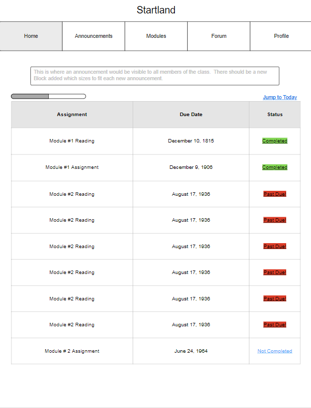
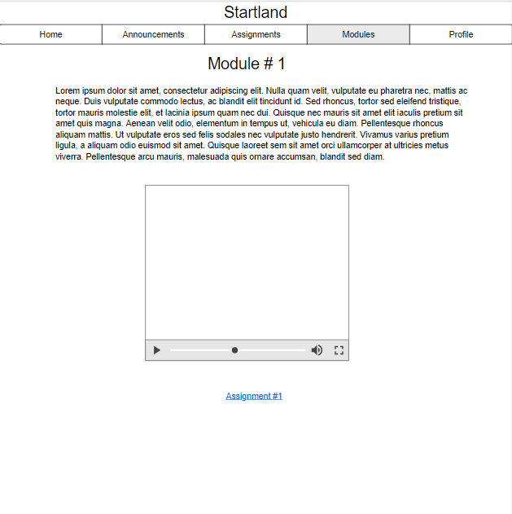
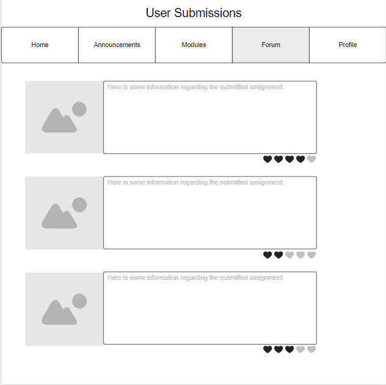

# Project Planning
For this assignment, you'll create some initial plans for your project.

## Assignment Description
[Project Planning Assignment](https://education.launchcode.org/liftoff/modules/assignments/project-planning)

## Submission Instructions

### Wireframes

Include at least 3 wireframes here, adding images or files to your repository as necessary. Format them as a bulleted/unordered list with links to the files.

*Startland Home Page

*Startland Module Page

*Startland Forum Main

### Project Tracker

Include a link to your public Trello board. Be sure you have user stories added for at least your first 2-week sprint.

[Group Trello Board](https://trello.com/b/K0vFgOML/team-logan-liftoff-project-board)

### Project Repo Link

Include a link to your project on GitHub.

[Group Project Repo](https://github.com/LaunchCodeLiftoffProjects/StartlandPortal)
